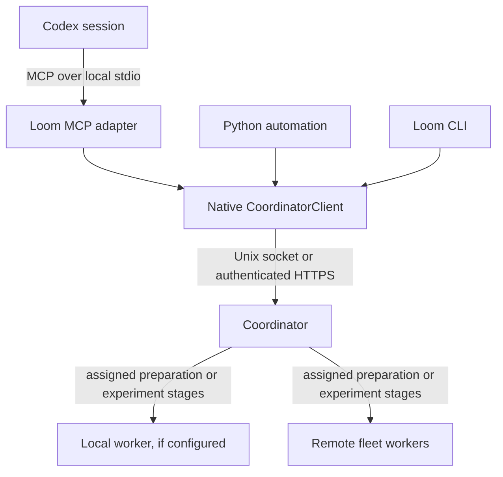

# Loom coordinator access, agent preparation, MCP, and skills

Status: all four Stage 40 implementation phases are merged into develop as of
2026-09-11, with passing required local validation and independent reviews.
Live Codex and physical NAS deployment trials remain unqualified. This document
explains the approved behavior and implementation approach. The
[implementation manifest](../roadmap/stage-40/implementation-plan.md) and linked
phase cards own the implementation contracts; the
[planning document](../roadmap/stage-40/planning.md) owns design decisions and
review status. Current usage is documented in the
[MCP feature guide](../features/mcp.md). Internal code sketches
are pseudocode, and sample paths/identifiers must be replaced for a deployment.

## Outcome and delivery phases

Stage 40 lets Python, CLI users, and Codex prepare, submit, inspect, monitor, and
cancel Loom work through the coordinator. The coordinator accepts work, schedules
it, and keeps durable records. Workers perform assigned preparation or experiment
stages. MCP exposes native operations; skills explain their proper sequence and
meaning across projects.

| Phase | Implementation | Useful result |
| --- | --- | --- |
| [1: coordinator client](../roadmap/stage-40/phases/coordinator-client.md) | One native client, complete Unix/HTTPS control, CLI migration | The same control workflow from the coordinator host or another machine |
| [2: shared preparation](../roadmap/stage-40/phases/agent-preparation.md) | Complete durable preparation using shared capture and an existing worker environment | Prepare through NAS, publish the canonical receipt, submit and execute |
| [3: transferred inputs](../roadmap/stage-40/phases/staged-preparation-inputs.md) | Bounded archive capture, existing relay and verified extraction | Use the same preparation lifecycle without shared project storage |
| [4: MCP and skills](../roadmap/stage-40/phases/mcp-skills.md) | Optional adapter, thirteen tools, four portable skills | Use both native modes from Codex across projects |

Phase 1 is useful independently. Phase 2 keeps capture, child execution, and
publication together because their recovery and cancellation behavior form one
usable operation. Phase 3 adds the distinct transfer/extraction boundary, and
Phase 4 wraps the completed native functionality. All four phases are delivered;
the manifest owns the validation, review and remaining deployment limitations.

Each phase is one independently mergeable PR, containing four or five smaller
implementation steps with focused tests. The extra phase gives the shared-NAS
workflow early value and a focused staged-input review. Recovery, cancellation,
publication and the storage migration remain part of the first preparation
release. Both source modes remain required for Stage 40 completion.

## Machines, processes, and responsibility



Assignment arrows show responsibility. Remote workers retain their existing
outbound connections to the coordinator. Every client mutation goes to the
coordinator; the MCP adapter does not relay through a worker daemon.

| Where the client runs | Coordinator connection | Required on the client host |
| --- | --- | --- |
| Coordinator machine | Existing Unix socket | Native client; MCP extra when using the adapter |
| Laptop or another machine | HTTPS with an enrolled client certificate | Native client, protected connection file and credentials |
| Fleet worker machine | Same direct HTTPS client, independently of its worker service | Client credentials with the appropriate client role |

A worker daemon is not required on a laptop running Codex. Constructing the
client does not start a service, register an agent, or submit work. The first
operation connects and negotiates capabilities. The adapter is a session process;
the configured coordinator and workers are long-running services.

Closing Codex releases its client connection. Accepted work continues. A later
session can recover it using saved coordinator, operation, and admission/queue
identifiers. A native run URI names a coordinator-owned run; a client must not
assume it can open that URI as a path on its own machine.

## Phase 1: one native coordinator client

Loom already has a typed native client view, Unix client operations, and HTTPS
client submit/status/cancel. The missing pieces are complete HTTP coverage,
consistent client construction and decoding, and bounded/error-aware control.
The new public entrypoint is `loom.coordinator.CoordinatorClient`.

```python
from loom.coordinator import CoordinatorClient

# On the coordinator host:
local = CoordinatorClient.from_unix_socket("/path/to/coordinator.sock")

# On another host:
remote = CoordinatorClient.from_connection_file("/path/to/client.yaml")
```

Both instances offer the same method meanings. The Phase 1 card owns exact
signatures, native result types, legacy compatibility, and error rules.

| Purpose | Native methods |
| --- | --- |
| Connection and service discovery | `describe_connection()`, `status()` |
| Submitted work | `admissions()`, `admission()`, `admission_for_queue_item()` |
| Observed worker availability | `agents()`, `agent()` |
| Run diagnostics | `inspect_run()` |
| Durable operations | `operation()`, `wait_operation()` |
| Admission and control | `submit()`, `wait_admission()`, `cancel()` |
| Explicit terminal wait convenience | `wait()` |
| Added in Phase 2 | `prepare_run()`, `cancel_preparation()` |

`describe_connection()` returns coordinator identity/epoch, transport/protocol,
capabilities, and safe preparation source/profile aliases. New clients require
`daemon-control-v1`. Phase 2 adds `agent-preparation-v1` only when preparation is
supported and enabled. Neither capability nor an availability observation grants
authority, reserves resources, or guarantees a worker is currently free.

The remote connection file has this schema:

```yaml
schema_version: 1
kind: loom.coordinator-client
transport:
  kind: https
  url: https://coordinator.example:8443
  server_ca_path: /etc/loom/ca.crt
  certificate_path: /etc/loom/client.crt
  private_key_path: /etc/loom/client.key
expected_coordinator_id: coordinator-production-001
```

Paths resolve under the existing protected file/owner rules, with relative paths
resolved against the connection file. HTTPS checks the server's certificate and
name and requires an enrolled client certificate; redirects are not followed.
Unix retains existing owner/peer checks. Client authorization remains
deployment-wide. Query, client, worker, and operator role boundaries remain with
their existing owners; a worker credential does not become a submitting client.

`expected_coordinator_id` is optional. It guards recovery if an endpoint later
points to a different deployment. The effective guard travels in each native
request and is checked by the coordinator before any lookup or mutation. A
handshake check alone would leave a reconnect race. Constructors and methods
accept the guard; a call value must match a configured default when both exist.
An omitted guard retains unguarded behavior for compatible callers.

For example, after preparation has supplied `prepared_receipt`:

```python
from loom.coordinator import CoordinatorClient
from loom.queue import LocalDaemonAdmissionRequest

with CoordinatorClient.from_connection_file("/path/to/client.yaml") as client:
    admission = client.submit(
        LocalDaemonAdmissionRequest(
            queue_item_id="experiment-042",
            run_uri=prepared_receipt.run_uri,
        )
    )
    detail = client.admission(admission.admission_id)
    observation = client.wait_admission(
        admission.admission_id,
        expected_revision=detail.admission.revision,
        timeout_seconds=25,
    )
```

An admission is the durable acceptance record. Its ACTIVE state does not prove
that a stage has started. The revision lets a caller ask whether the admission
changed since its last observation. Wait results preserve native CHANGED,
TERMINAL, and TIMEOUT meanings. Queue-item lookup followed by detail is two
observations, not one atomic snapshot.

New observation calls accept finite durations from zero to 25 seconds. Zero makes
one nonblocking observation. Pages default to 20 items and allow 1 through 100,
using opaque native cursors. Finite calls have a cumulative 30-second budget for
connection, capacity admission, writes, and response reads. HTTPS uses bounded
server wait slices; Unix retains its shorter slices. Waiting calls cannot hold
the mutation lock or exhaust ordinary/worker progress capacity. The explicit
`wait()` terminal convenience can renew bounded observations indefinitely only
when its caller deliberately requests an unlimited overall wait.

`CoordinatorClientError` preserves a readable message and structured code,
boundary, operation, IDs, evidence references, and mutation outcome. Errors can
distinguish invalid input, authorization, conflict, unavailable service, deadline,
capacity, oversized results, and invalid responses. General responses fit the
existing 1 MiB ceiling; nested diagnostic evidence keeps its native meaning.

A failed job or failed preparation is a successful read of failure evidence.
A lost mutation response has an unknown outcome unless authoritative evidence
establishes what happened. The client must retain the same request identity and
reconcile it. An immediate not-found can race a still-running original request;
it does not justify a fresh queue ID. No blanket mutation retry is introduced.

Internally, common native control validation, serialization, decoding, and
matching dispatch get one owner. Unix/HTTPS retain authentication and framing.
The public facade combines queue and diagnostics above those layers, so queue
and runtime do not import diagnostics, MCP, or project modules. HTTP extends the
existing application protocol and `/v1/client/<operation>` routes; it needs no
new scheduler or general call-any-method API.

## Phase 2: shared preparation and the common lifecycle

Suppose A is the coordinator, B is a preparation worker, and C may later execute
experiment stages. Project tools author configuration in storage visible to A.
The request then selects those inputs and a configured existing environment:

```json
{
  "operation_id": "prepare-experiment-042",
  "run_name": "experiment-042",
  "source": {
    "mode": "shared",
    "root": "projects",
    "path": "example-project",
    "include": ["configs"]
  },
  "config_path": "configs/experiment.yaml",
  "preparation_profile": "example-cpu"
}
```

| Field | Meaning |
| --- | --- |
| `operation_id` | Stable identity of the preparation request and its recovery |
| `run_name` | Target name for canonical publication |
| `source.root` | Protected coordinator source-root alias |
| `source.path` | Project location relative to that root |
| `source.include` | Explicit selected files/directories relative to the project |
| `config_path` | Included regular configuration file relative to the project |
| `preparation_profile` | Protected alias selecting an existing qualified installation and child runtime policy |

The native `PrepareRunRequest` carries these fields. `prepare_run(request)`
returns a `LocalDaemonOperation`; existing operation/read/wait methods observe it.
The CLI adds `loom queue daemon-prepare --request PATH` and
`daemon-cancel-preparation OPERATION_ID`, using the common connection and guard
options. Existing operation/wait commands provide progress.

Phase 2 implements shared mode. It advertises only effective shared support,
even if protected policy names a future mode. A well-formed staged request is
unsupported/not_applied before operation/child/target reservation, capture or
dispatch. Phase 3 enables staged inputs through this same API. Configured
permission and currently implemented support must both allow a mode.

Project workflows own authoring, parameters, scientific tests, and interpretation.
The MCP client is not a remote file editor. A laptop connection does not upload
its local project; authored inputs must already be available to A through the
project's normal storage/authoring workflow.

### Selecting an existing environment

Protected coordinator preparation settings map source aliases to local paths and
optional shared snapshot roots. Profile aliases select a uniquely resolved
resident profile, allowed roots/modes, and existing runtime options for the
preparation child. Worker configuration supplies any required shared snapshot
root mappings. Host mount prefixes can differ.

No default environment or unrestricted source root is inferred. The caller
selects an allowed alias, not an interpreter path, shell command, or installer.
Readiness qualifies the preparation module in the actual selected installed
Python and requires the new preparation-input capability. Ordinary job delivery
and old worker records retain their existing meanings.

Acceptance freezes the selected protected configuration/profile identity.
Identical replay after a reload cannot silently choose another environment.
Absent preparation configuration keeps the capability disabled and preserves
existing configuration identity/serialization. An accepted operation may wait
for eligible capacity; it does not reserve resources for the eventual target.

The initial workflow uses one qualified environment to prepare all target stages.
It reports exact native per-stage software requirements while existing runtime
owners retain authored resource and placement settings. Environment/package
installation and qualification updates are separate operator/project work.

### Capturing shared inputs

Shared mode captures the selected authoring files once into configured shared
snapshot storage. Workers read that same snapshot through protected mappings.
There is no per-worker project copy. A manifest records each sorted
project-relative path, byte size, and SHA-256 hash; its digest identifies the
captured input. Equal path strings alone do not prove equal content.

Shared capture is finite: at most 100 include entries, 4,096 captured files, and
64 MiB of selected file content. Includes are explicit files/directories, not
globs. Traversal, links, special files, excessive size, and missing required
mappings fail explicitly. Shared mode does not silently fall back to staged
mode. Phase 3 applies these selection bounds plus archive/transfer/extraction
limits to the same preparation operation.

The operation can be accepted before capture completes. Its input receipt is
null until the complete capture is published. Detected file/list changes produce
`source_changed`; the snapshot records consumed bytes without claiming an atomic
Git revision. Authors should wait for capture before further edits or supply
stable input directories. Once the receipt exists, restart never recaptures from
newly edited source. A crash before a ready receipt may retry capture after
discarding only operation-owned temporary files.

Captured inputs serve the preparation child. They do not install changed Python
implementations or become implicit inputs of every target stage. Target execution
uses portable resolved values, compatible installed code, and existing supported
artifact/data bindings. Executable intent cannot retain B's temporary scratch
path. Diagnostic/provenance paths retain their meaning; arbitrary configuration
strings are not rewritten. A project needing a captured file at execution must
provide an already supported explicit binding.

On NAS, an existing editable installation may see shared project files. Loom
still checks installation/launch identity. Shared storage does not make Python
environments interchangeable or provide continuous source immutability.

### One checked composition and one canonical publication

A first reserves the operation and child identities. It then bootstraps a small
fixed Loom preparation stage using the selected native requirements, runtime
options, and captured input reference. This needs no prior experiment composition.
The ordinary scheduler, resources, assignment fencing, supervision, and committed
output machinery run the child on B.

Its central behavior is approximately:

```python
# Illustrative internal flow on the selected worker.
composed = compose_config(captured_project_directory / request.config_path)
preflight = run_preflight_composed(composed, check_request)

# Commit one report containing that composition, the checks,
# input/profile identities, and exact stage execution requirements.
```

The new diagnostics entrypoint checks a supplied composition without reloading
the path, reapplying overlays, or executing overrides. Existing path-based
`run_preflight()` shares the same check implementation and retains its behavior.
Preparation uses CONFIG, PIPELINE, SELECTORS, and RUNTIME checks. Readiness owns
installation facts; A checks its own store/authority/publication facts. B's
scratch directory cannot stand in for A's run store. Scientific tests remain
project-owned.

The child report contains the existing resolved/redacted configuration,
composition manifest, recipe manifest, provenance, native per-stage requirements,
safe profile descriptor, preflight results, and operation/input identity. A
accepts only a committed report from its recorded child with matching identities.
It decodes plain data using native shapes, without unpickling, executing recipes,
or composing again. The coordinator needs no project preparation environment.

After identity, required-check, stage-coverage, portability, and result-size
validation, and under the durable publication claim described below, A uses the
existing managed publisher:

```python
# Core publication call; surrounding orchestration owns claims and recovery.
receipt = prepare_managed_run(
    service_snapshot,
    received_composition,
    run_name,
    execution_requirements=received_requirements,
)
```

This function already accepts composed inputs and explicit requirements without
recomposition. It creates canonical configuration, plan, runtime, and embedded
authority records. Recipe evidence needs one adjacent correction: normalize
supported Weave mapping/object forms at the existing publisher for fresh writes
and replay, preserving nonempty recipes and provenance.

The existing receipt remains:

```python
@dataclass(frozen=True, slots=True)
class ManagedLocalPreparationReceipt:
    run_uri: str
    plan_digest: str
    runtime_digest: str
    stage_names: tuple[str, ...]
```

A child can successfully produce a report whose required checks failed. That
yields failed preparation with evidence. A worker/compose crash instead retains
the child's failure evidence. Successful checks also do not prove final
publication. Only an applied operation with its canonical receipt completes
preparation. No target stage executes as part of this workflow.

The preparation result adds `coordinator_id` alongside the unchanged receipt.
It also exposes input receipt, child admission ID, aggregate `preflight_status`,
optional complete inline `preflight`, pinned `report_ref`, and bounded evidence
references. The outer `LocalDaemonOperation` model remains unchanged.

### Durable state, recovery, and cancellation

The coordinator persists accepted intent/caller, selected settings, child and
target identities, input receipt, cancellation request, publication claim, and
final result. Minimal preparation linkage extends the existing control state;
MCP adds no separate database.

| Operation state | Meaning |
| --- | --- |
| `pending` | Capture, child queue/execution, or cancellation reconciliation is outstanding |
| `applying` | The coordinator durably claimed final publication |
| `applied` | Complete canonical publication; prepared receipt available |
| `failed` | Capture, checks, child execution, or publication failed; code/evidence identifies which |
| `cancelled` | Publication was excluded and no-dispatch or native terminal/release proof establishes cancellation |
| `conflict` | Existing operation/intent/target state prevents this publication |

The child admission supplies detailed execution evidence; a second detailed
execution state machine is unnecessary.

| Event | Planned behavior |
| --- | --- |
| Client or Codex closes | Accepted preparation and admitted work continue |
| Reply is lost | Reconcile the same IDs with the saved coordinator guard |
| Same caller repeats identical preparation intent | Return/reconcile the originally accepted operation and selected settings |
| Same ID is reused with changed intent or another caller | Conflict; no takeover or new interpretation |
| Different preparations choose the same target | Target ownership prevents concurrent publication |
| Coordinator restarts | Rejoin the recorded capture/child and complete or replay the same publication |
| Complete matching target exists | Native read-only replay |
| Partial, changed, or corrupt target exists | Preserve it and report an inspectable conflict |

The publication claim is durable before publisher I/O; restart can therefore
reconcile an interrupted finalization. Long composition and file I/O do not hold
the global mutation lock. Stable identities and native replay avoid accidental
duplicate admission/publication without claiming exactly-once execution.

Before the claim, an explicit preparation cancellation wins publication
exclusion and cancels/reconciles the child. The operation stays pending until
the required lifecycle evidence exists. A cancellation ACK, lost worker, or root
process exit alone is insufficient. After the claim, finish/reconcile publication
and return its actual outcome, including applied if successful. Cancellation
does not delete a published target or invent rollback. Repeated terminal cancels
observe the existing result.

The full preparation operation response is at most 64 KiB. State, identities,
full native receipt, report reference, and bounded evidence references have
priority over optional inline preflight. If the complete preflight does not fit,
its aggregate status and pinned report reference remain visible. No individual
diagnostic is silently truncated. If even the required prospective receipt cannot
fit, fail before writing target state. Full reports use existing authorized
artifact/run-store tooling; no general client download API is added.

Operation records and linked input/report evidence remain retained for replay.
Cleanup must not delete referenced evidence needed for recovery. Assignment
scratch follows existing terminal/release cleanup. Failed/cancelled captures can
consume space; automatic expiration, operation deletion, and new garbage
collection are deferred.

### Submission and later placement

Preparation ends at the receipt. A prepare-only request stops there. A user
request to prepare and run permits the next explicit native submission without
another artificial approval step. The coordinator never auto-submits from the
preparation operation itself.

Submission then creates the normal admission. The scheduler may place stages on
B or C according to each stage's software, resource, placement, and input
requirements. Preparation on B creates no host affinity. C must have compatible
installed code and accessible required data; B's successful earlier checks do
not certify C's current filesystem or availability.

## Phase 3: preparation with transferred inputs

This phase adds `source.mode: staged` for coordinator and worker project storage
that is not shared. The root/profile aliases, selected files, config path,
operation/report shapes and publication lifecycle keep their existing meaning.
For example:

```json
{
  "operation_id": "prepare-staged-042",
  "run_name": "staged-042",
  "source": {
    "mode": "staged",
    "root": "projects",
    "path": "example-project",
    "include": ["configs"]
  },
  "config_path": "configs/experiment.yaml",
  "preparation_profile": "example-cpu"
}
```

A commits an archive containing the existing manifest and selected closure,
records an ArtifactRef in the input receipt, and uses the existing regular-file
relay to deliver it to B. Extraction occurs beneath the assignment workspace,
away from the installed environment. The worker verifies the manifest/content
before input becomes ready. It then runs the same preparation child and returns
the same report to the same coordinator publisher.

Selection still allows at most 100 includes and 4,096 captured files. Selected
and expanded content must fit 64 MiB; the archive plus other assignment inputs
must fit the existing aggregate 64 MiB transfer limit. Extraction rejects
absolute/traversing paths, links, special files, duplicate destinations and
excessive expanded counts/bytes. Transfer integrity/replay belong to the relay;
archive containment/expansion belong to extraction. Inputs remain finite
preparation data rather than package installation or dataset delivery.

Advertised modes reflect implemented support and protected policy. A selected
installation must actually support staged handling; an earlier shared-only
worker's preparation-input capability alone is insufficient. Existing readiness,
software identity and assignment eligibility enforce that distinction. Enabling
the new mode never installs or modifies a worker environment automatically.

Interrupted capture/transfer/extraction and cancellation rejoin Phase 2's durable
operation. They cannot create another child, publish incomplete input, recapture
after a ready receipt, or bypass the publication claim. The archive and report
remain pinned for recovery. Existing shared operations and receipts reopen under
coordinator schema 13; this phase adds no second root migration or new lifecycle.

Its four implementation steps are archive capture, relay/extraction and access,
effective mode support, and the complete staged journey with relevant recovery
and compatibility checks. Common publication/recipe/identity evidence is reused
while unchanged. The [Phase 3 card](../roadmap/stage-40/phases/staged-preparation-inputs.md)
owns the transferred-input boundary and its complete acceptance obligations.

## Phase 4: MCP tools and portable skills

The optional `loom[mcp]` extra supplies the SDK adapter and `loom-mcp` executable.
The entrypoint selects exactly one native endpoint/connection and accepts the
optional coordinator guard. SDK imports remain outside base Loom, daemon, and
native-client imports. Protocol output uses stdout; logging uses stderr.

The submission mapping is approximately:

```python
# Illustrative tool body. SDK registration, bounded execution, and
# native error conversion surround it; client is the configured facade.
def loom_submit_run(run_uri, queue_item_id, expected_coordinator_id=None):
    admission = client.submit(
        LocalDaemonAdmissionRequest(
            queue_item_id=queue_item_id,
            run_uri=run_uri,
        ),
        expected_coordinator_id=expected_coordinator_id,
    )
    return admission.to_dict()
```

The adapter translates arguments/results. Native owners retain scheduling,
preparation, publication, authorization, and durable truth. It does not parse CLI
output or repair missing native behavior with an MCP-only engine.

| Tool | Purpose |
| --- | --- |
| `loom_status` | Connection description/capabilities and native coordinator status |
| `loom_prepare_run` | Request asynchronous preparation |
| `loom_get_operation` | Read the native operation and evidence |
| `loom_wait_for_operation` | Bounded operation observation |
| `loom_cancel_preparation` | Explicit preparation cancellation |
| `loom_list_jobs` | List admissions, including preparation children |
| `loom_get_job` | Read admission detail by admission or queue-item ID |
| `loom_inspect_run` | Native diagnostic success/failure union for an admitted run |
| `loom_list_agents` | Observed worker inventory/availability |
| `loom_get_agent` | Read one worker projection |
| `loom_submit_run` | Submit a prepared run URI with a stable queue-item ID |
| `loom_wait_for_change` | Bounded observation of an admission revision |
| `loom_cancel_job` | Native job cancellation acknowledgement |

All thirteen accept optional `expected_coordinator_id`, forwarded to the native
server check. Native IDs, result/status models, page limits, and wait bounds stay
intact. Read/mutation annotations describe tools but do not authorize calls.
Well-formed calls failing at a native client boundary return MCP `isError=true`
with structured details. Reading a failed preparation/job or a native diagnostic
failure is a successful observation of evidence.

Tools register even if the coordinator is offline. Connection/capability checks
are lazy, and unavailable status is reported truthfully rather than as an empty
healthy queue. Cached metadata is labelled last observed and refreshed after
reconnect; it is not current capacity or authorization.

Synchronous calls run outside the SDK event loop with bounded outstanding work.
Waiting calls leave ordinary-call capacity available, and executor admission
consumes the native request budget. EOF, tool cancellation, and process shutdown
release observations/resources without issuing lifecycle cancellation. A sent
mutation may finish remotely after a tool disappears; retain its original IDs.

### Four project-neutral operational skills

| Skill | Procedure and value |
| --- | --- |
| `loom-prepare` | Consume authored inputs and explicit profile, inspect supported aliases/mode, request with stable identity, observe, return receipt or failure |
| `loom-run` | Submit a receipt, reconcile uncertain admission with the same queue ID, handle requested cancellation and observe its actual outcome |
| `loom-monitor` | Use bounded reads/waits and distinguish acceptance, availability, placement, execution, and terminal evidence |
| `loom-diagnose` | Trace source, installation, checks, scheduling, and execution failures using native ownership/freshness and evidence |

For example, preparation instructions consume the project's configuration and
environment choice, retain one operation ID, wait as requested, and finish at
the receipt for a prepare-only task. Monitoring a one-off status question does
not start indefinite observation. Diagnosis explains the smallest evidenced
remedy and routes installation/science changes to the appropriate owner.

Skills live in `skills/loom-prepare/`, `skills/loom-run/`, `skills/loom-monitor/`,
and `skills/loom-diagnose/`, outside contributor workflows. They can be installed
or linked once per user and updated from that source. Any required bundled
reference resolves relative to the individual skill directory after relocation.
No fixed NAS paths or entire repository copy is required.

Project workflows own datasets, models, scientific parameters/tests, environment
choice, and interpretation. Loom skills assume no metric, stage name, GPU amount,
or project registry. They add no environment creation, automatic code repair,
operator recovery, or skill state store. Large diagnostic reports are identified
by their reference and routed to existing authorized artifact tooling.

### Codex registration after implementation

Codex starts the adapter in its client environment. Loom services and qualified
worker environments already exist. With actual deployment paths substituted:

```sh
codex mcp add loom -- /absolute/path/to/client-env/bin/loom-mcp --connection /absolute/path/to/client.yaml
```

The corresponding server entry is:

```toml
[mcp_servers.loom]
command = "/absolute/path/to/client-env/bin/loom-mcp"
args = ["--connection", "/absolute/path/to/client.yaml"]
tool_timeout_sec = 60
```

On the coordinator host, substitute `--endpoint /path/to/coordinator.sock`.
On recovery, supply the saved guard in the native connection, executable option,
or tool call. The 60-second Codex timeout leaves room around the native 30-second
request budget and maximum 25-second observation. Observation timeout does not
cancel work.

Registration syntax and the timeout setting were checked against the installed
Codex CLI and [official MCP documentation](https://learn.chatgpt.com/docs/extend/mcp?surface=cli)
on 2026-09-10. Phase 4 must still verify its actual SDK integration and run a
synthetic Codex trial before claiming live acceptance. This example does not
configure a real session, enroll credentials, or start experiments.

## Implement, migrate, remove, and preserve

| Area | Change | Why |
| --- | --- | --- |
| New `src/loom/coordinator.py` | Public native client facade | Python, CLI, and MCP share one behavior |
| Existing socket/HTTP transports | Shared control mechanics, missing HTTP operations, deadlines/errors/guard | Consistent remote and local control |
| Existing CLI client commands | Common `--endpoint` / `--connection` and optional guard | Preserve familiar commands with both transports |
| `LocalDaemonSocketClient` | Thin compatibility adapter retaining old defaults, signatures, and errors | Existing consumers remain supported |
| Worker HTTP client | Extract compatible connection mechanics; retain worker lifecycle | Submitting clients need no worker journal or supervisor |
| Internal decoders/dispatch and socket busy retry | Remove duplicates after migration; use bounded saturation handling | Reduce divergence and preserve ordinary/worker progress |
| Coordinator control state | Minimal durable preparation linkage/reconciliation | Recover accepted work after requester loss or restart |
| Staged input capture/access | Archive, native relay and contained extraction in Phase 3 | Add non-shared delivery to the same operation without another migration |
| Proposed `src/loom/preparation.py` | Fixed child and diagnostics integration above queue | Execute checks in the selected environment |
| Existing preflight/publisher | Supplied-composition checks and recipe normalization | Publish exactly what was checked |
| New `src/loom/mcp/` and `skills/` | Optional tools and portable procedures | Assistant access without SDK dependencies in runtime |

Preserve the scheduler, resource contracts, worker supervision, authority,
artifact relay, diagnostic models, and native managed publisher. QueueClient/
QueueService keep their separate queue-item/controller contract. Public
LocalDaemon record names remain intentional; no public legacy removal is
scheduled in Stage 40. Administrative commands stay outside client migration
unless they already belong to that client view.

### Retained-root upgrade and rollout

At the approved evidence revision, coordinator and worker roots both require
schema 12. Phase 2 splits role-version checks: coordinator advances to 13 and
worker roots/journals stay on 12. Existing run, authority, admission, and stable
deployment identities remain intact. Recheck the actual published predecessor
before implementation; an intervening version change needs reconciliation.

`loom queue daemon-upgrade` is a local administrative operation using existing
role-config/env-file inputs, never an MCP/client tool. It requires a stopped
coordinator, exclusive lock, correct ownership/permissions, valid deployment
binding, and supported predecessor. Use SQLite backup to make a protected
identity-labelled backup, then add preparation storage and update the marker in
one transaction. A pre-commit failure leaves the old schema. A valid repeated
upgrade reports current identity/version without rewriting retained work.

Running, corrupt, or unsupported roots are refused without mutation. The upgrade
does not reset roots, change admission IDs, or modify worker databases. Old
binaries cannot open the upgraded coordinator; automatic downgrade is not
provided. A backup restore after new work has been accepted requires a separately
assessed recovery procedure.

Rollout is: upgrade/restart coordinator; qualify participating existing worker
installations; configure allowed preparation roots/profiles; enable shared native
preparation; add qualified staged support in Phase 3; enable MCP in Phase 4.
Old clients keep their established subset. Old agents can continue
compatible ordinary work but cannot receive preparation requiring a capability
or installation they lack. The preparation request never runs an installer.

## Limits and implementation evidence

Preparation initially requires embedded coordinator authority and a service
with no configured SLURM profiles, matching the native publisher. This limit
applies to preparation, not to Phase 1's existing control operations. The first
version supports one qualified preparation environment and finite selected
inputs. General code deployment, dataset distribution, laptop upload, automatic
path rewriting, per-project ACLs, hosted MCP, and plugin packaging are deferred.

The [later lifecycle plan](../roadmap/stage-41/implementation-plan.md) separately
proposes service startup and broader execution changes after Stage 40. Those
future changes do not silently add requirements to this approved stage.

| Phase | Required evidence |
| --- | --- |
| 1 | Real Unix/loopback HTTPS parity, role and identity guards, old-client/CLI compatibility, lost responses, bounded waits, concurrent worker/control progress |
| 2 | Actual selected worker Python, shared captures, exact checked/published composition and nonempty recipes, prepare B/execute C, full restart/replay/cancellation, populated-root preservation, staged refused before mutation |
| 3 | Bounded archive and disjoint-root delivery/extraction, truthful mode/installation support, staged interruption/recovery/cancellation, target portability and retained shared compatibility |
| 4 | Real SDK stdio discovery/calls, offline startup, native errors/evidence, bounded concurrency, close/reconnect, optional dependency isolation, four relocated skills across unrelated synthetic projects |

Each phase uses its own worktree/branch and PR to develop, with the successor
starting after predecessor merge. Required local checks are `make validate-pr`
and `make test-summary`, plus the independent implementation review required by
the cards. Phase 4 integrates an isolated MCP-extra lane so required SDK tests
cannot silently skip or leak into the base installation. Hosted CI remains
disabled.

Separate synthetic trials in a real Codex session and on two physical machines
with shared NAS establish deployment evidence. Temporary directories and loopback
tests cannot establish those facts. If unavailable, record the precise release
limitation. The documentation and startup reviews establish plan readiness;
they do not substitute for runtime tests, root upgrades, or live acceptance.
