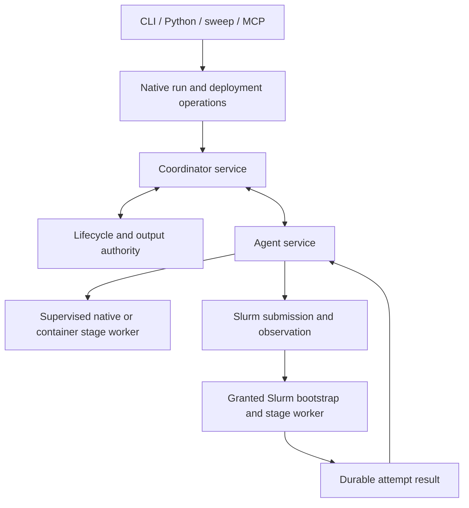

# Unified run lifecycle

Status: explanatory overview of the Stage 41 baseline approved on 2026-09-10. The canonical
[behavior/design plan](../roadmap/stage-41/planning.md),
[implementation manifest](../roadmap/stage-41/implementation-plan.md) and linked
phase plans own requirements, contracts, validation and approval state. This is
planned behavior; documenting it does not make it available in the runtime.

Stage 41 builds on the delivered [Stage 40 client/preparation/MCP implementation](../roadmap/stage-40/implementation-plan.md).
The [published-source refinement](../roadmap/stage-41/planning.md#published-baseline-and-amendment-ownership)
records current contracts and the requested startup-readiness review. Stage 41 extends preparation
and deliberately removes its preserved historical execution surfaces. Existing
outputs are retained; compatibility adapters and live-state migration are not
part of the agreed cutover.

One run selects a configured deployment, starts or reuses its required services,
prepares and admits work, executes stages through agents, exposes status/results,
and settles the services it owns. CLI, Python, sweeps and MCP use that lifecycle.

MCP selects one protected deployment at server startup; its run, query and
cancellation tools share that binding. The ordinary CLI's config/overlay paths
refer to the deployment's selected coordinator-readable project. Staged preparation
does not upload client files. Existing artifact transfer bounds still apply to
shared Slurm results; larger checkpoints require separately accepted support.

The coordinator retains the prepare-to-admission continuation once it accepts a
run request. A client disappearing during preparation cannot strand the request
as preparation-only. Clients reconnect with the original operation/admission
identities; they do not recreate jobs to recover a lost response.

| Term | Responsibility |
| --- | --- |
| Coordinator service | Accepts work, decides readiness/placement, owns assignments, reconciles and answers queries |
| Agent service / worker agent | Spans attempts, advertises authorized capabilities, launches and observes backend work |
| Stage worker process | Executes one stage attempt's project code in the selected environment |
| Backend / executor | Agent-owned execution mechanism for native, container or Slurm |
| Process supervisor | Owns local processes, containment and durable execution receipts |
| Authority | Accepts lifecycle transitions, current fences and output commits |
| Daemon | A background service process; not an extra mandatory scheduling role alongside coordinator and agent |

A coordinator and agent may share a process when their configured lifetimes match.
Different responsibilities do not require one process per noun. An agent can be
persistent even though it creates short-lived workers for individual attempts.

| Deployment | Startup and execution | End of this run |
| --- | --- | --- |
| Fresh configured local | Initialize/bind state automatically; start coordinator and agent; supervised workers | Stop run-owned roles after settlement; retain state |
| Existing persistent local | Connect to the same coordinator/agent | Keep persistent services running |
| Mixed service lifetimes | Start/reuse each configured role independently | Stop only eligible run-owned roles |
| Fleet | Connect to coordinator; use authenticated offers from existing outbound agents | Preserve borrowed agents; no implicit remote provisioning |
| Connected Slurm | Start/reuse permitted services; assigned submit agent owns sbatch, observation and cancellation | Reconcile exact jobs/results before retiring run-owned roles |

Run-owned services are shared by all work they accept. One finished run cannot
stop another run's services. Detach, Ctrl-C, EOF and wait timeout stop observation;
cancellation is explicit. A cleanup problem is reported separately from the
committed run result. Service shutdown never deletes durable state or outputs.

For Slurm, helper exit is not stage completion, queue absence is not failure,
and scheduler completion is not an output commit. The assigned agent is the sole
submission-operation owner. Compute retains its typed result and output manifest
on qualified shared storage before notification; the agent can deliver it after
the job has exited and the coordinator restarts. The coordinator/authority path
remains the sole finalizer, with containment tracked separately.

New stage starts require a coordinator grant. Already-granted work may continue
during an outage; ungranted bootstraps wait with bounded deadlines. Site-specific
profiles still own submit-host permissions, account/partition/QoS, resources,
trust, installed environments and durable result storage. Same-root restart does
not imply lost-state reconstruction or cross-host failover.

The same command remains the intended interface inside a granted allocation,
using a qualified allocated-resource/native/container profile and required srun
binding. New allocation acquisition/hosting, offline starts, transparent requeue,
HA and multi-node integration are deferred; nested sbatch is not inferred.

Implementation uses nine approved phases, one coherent behavior change and PR
per phase. Each includes implementation, tests, documentation and removal of the
code it replaces. The links below open each card's detailed implementation
walkthrough, including core changes, interface examples, ownership and recovery
behavior. Snippets illustrate planned interfaces or explicitly marked pseudocode;
private helper names and example configuration layouts remain implementation
choices. Each card's fixed contracts, validation plan and handoffs govern delivery:

1. [Preparation And Publication](../roadmap/stage-41/phases/preparation-publication.md#implementation-walkthrough-and-examples): Prepare exact invocation intent and publish a truthful, replayable target through the selected authority.
2. [Durable Run Operation](../roadmap/stage-41/phases/durable-run-operation.md#implementation-walkthrough-and-examples): An accepted run reaches its exact admission after client loss and supports race-safe cancellation and observation against existing services.
3. [Service Startup And Lifetime](../roadmap/stage-41/phases/service-startup-lifetime.md#implementation-walkthrough-and-examples): The ordinary run command connects or safely starts configured services, then cleans only the roles whose lifetime permits it.
4. [Agent Worker Execution](../roadmap/stage-41/phases/agent-worker-execution.md#implementation-walkthrough-and-examples): Native and configured container attempts use the same agent-owned worker and result boundary with correct resource and containment evidence.
5. [Agent-Owned Slurm Jobs](../roadmap/stage-41/phases/agent-slurm-jobs.md#implementation-walkthrough-and-examples): One assigned agent submits, observes, cancels and recovers the exact Slurm job without duplicate submission or capacity accounting.
6. [Slurm Result Recovery](../roadmap/stage-41/phases/slurm-result-recovery.md#implementation-walkthrough-and-examples): A job can finish and its compute process exit during coordinator downtime; the recovered submit agent delivers the same result for one authority commit.
7. [Unified Sweeps](../roadmap/stage-41/phases/unified-sweeps.md#implementation-walkthrough-and-examples): Sweep trials use the unified run lifecycle with unchanged experiment meaning and stable retry identities.
8. [Unified MCP And Skills](../roadmap/stage-41/phases/unified-mcp.md#implementation-walkthrough-and-examples): MCP runs, observes and cancels through the same native service/run owners, with updated skills and no private lifecycle.
9. [Complete Execution Cutover](../roadmap/stage-41/phases/execution-cutover.md#implementation-walkthrough-and-examples): All production execution entrypoints use the unified lifecycle and the remaining shared obsolete engines are removed.

The dependency order is explicit in the manifest. Service startup/shutdown, run
continuation/cancellation, Slurm submission/reconciliation and result ingestion/
acknowledgement remain indivisible ownership changes. Stage 41 is incomplete
until all nine phases finish, including the final shared-removal audit. The
canonical packet owns detailed scope, validation and execution prerequisites.
