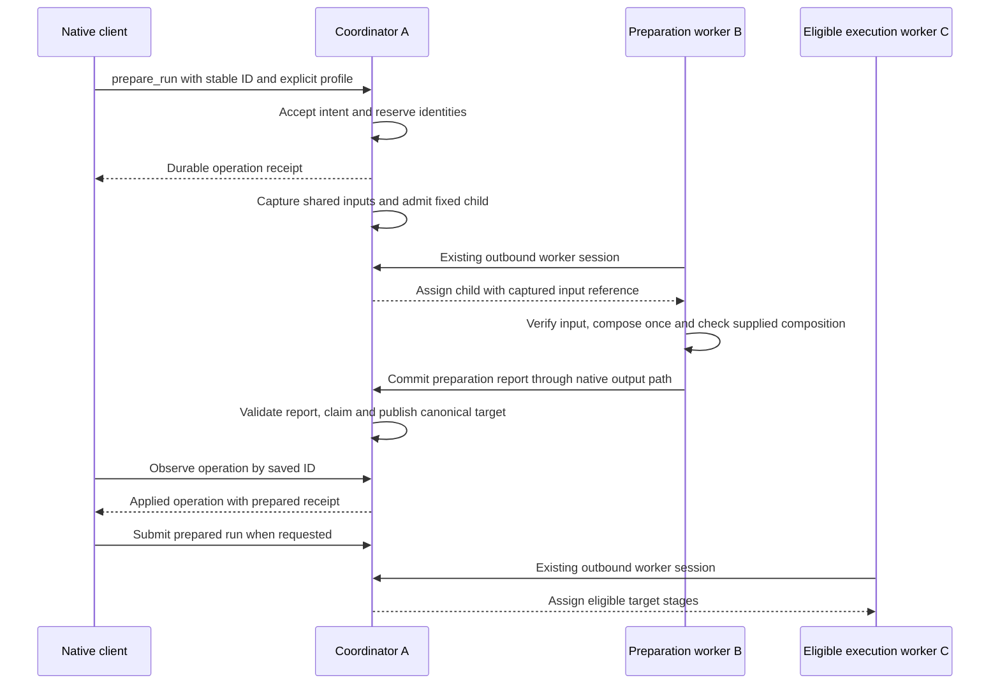

# Phase 2 Execution Plan: Durable Preparation On Shared Storage

## Metadata

- Status: in_progress
- Roadmap stage and phase: 40 / 2
- Manifest: [implementation-plan.md](../implementation-plan.md)
- Branch: agent/stage-40-p2-agent-preparation
- Stage worktree and coordination branch: from the manifest Execution Context;
  all phases share that stage worktree through synchronized closeout.
- Base revision: `5fe1b3750a387b80aea8b84df521c08e25e42b21`, published and synchronized after Phase 1 merge and metadata.
- PR target: develop
- PR title: Stage 40 Coordinator Client, Agent Preparation, And MCP - Phase 2: Durable Preparation On Shared Storage
- Dependencies: Phase 1 PR #298 remotely merged as `3b3942a88ee0729612f02fe3d7dbda3164c762d4`; stage plan approved on 2026-09-10
- Workflow path: expanded for durable operations, filesystem/process handoffs, migration and cancellation
- Blockers: none

### Execution startup

On 2026-09-11 the shared transition/publication/synchronization gates verified
Phase 1 delivery, then retired its exact merged local and remote phase branches.
The start gate created this phase branch in the retained Stage 40 worktree at
the published base above; control remains clean on develop. No implementation
work uses the control checkout.

The existing approved readiness receipt remains applicable to the published base.
Phase 1 supplies the accepted shared client/transport boundary. No intervening
product drift or missing contract requires planning refinement.

The optional executor returned a partial foundation at
`907fb9290d0992803a9aefd3e8f6d4214cd1ae56`. Ownership has returned to the manager
for all runtime, tests, documentation and delivery. The manager is completing the
ordinary child, protected binding and durable publication lifecycle. No executor
or explorer owns files or has authority to change branches.

Validation retains every obligation in Test And Validation Plan. Start with
source-mirrored checks of composition/publisher, configuration/capture, actual
child execution, durable lifecycle/migration and public control. Broaden when
shared assignment, root, admission, diagnostics or serialization changes affect
existing consumers. Both approved full commands remain final gates; local
fixtures do not claim physical fleet/NAS or live Codex qualification.

## Objective And Context

The native API prepares coordinator-authored configuration on an eligible local
or remote agent through shared storage using the specified existing environment,
returns the canonical coordinator receipt, and permits normal submission/execution.
Deliver the common lifecycle and shared-input coverage of FR-40-03 through 07/09/12
and DQ-40-02/03/04/06 through Phase 1's client. Phase 3 completes FR-40-04's staged
input behavior over the same request, operation, child report and publisher.

Preparation is an ordinary managed child run plus a coordinator finalization
operation. The child owns execution evidence; the existing managed publisher owns
the canonical target. MCP and skill implementation are excluded.

## Current Source And Harness

- `src/loom/queue/local_daemon.py`: LocalDaemonClientView, LocalDaemonOperation,
  operation projection/wait, root schema/lock, admission/cancellation/reconciliation.
- `src/loom/queue/managed_local_preparation.py`: prepare_managed_run,
  ManagedLocalPreparationReceipt, _persist_composed_config and _replay_receipt.
- `src/loom/queue/local_daemon_runtime.py`: persisted managed execution requirements.
- `src/loom/queue/_remote_stage_execution.py`: semantic assignments, fenced
  execution, regular-file input relay and committed output materialization.
- `src/loom/queue/deployment.py`, `resident_readiness.py`,
  `_agent_process_supervisor.py`: protected profiles, actual installed Python/code,
  observed descriptors and retained launch binding.
- `src/loom/diagnostics/preflight.py`, `models.py`: cached composition/checks and
  native PreflightResult.
- `src/loom/cli/queue.py`: service composition, native client commands and CLI output.
- Pinned Weave `388377b61cffbb225057082365f03cb0738996fd`: ComposedConfig,
  CompositionManifest/ConfigProvenance serializers; recipe_manifest is plain data.
- Existing tests: managed preparation, local daemon, deployment, agent transport,
  agent lifecycle, preflight contracts and import boundaries.

The publisher already accepts an already-composed object and an exact
stage-name-to-ExecutionRequirement mapping without a coordinator worker
installation. It supports embedded coordinator authority only and rejects a
service with configured SLURM profiles. Preserve that family limit. A nonempty
recipe currently exposes an adjacent mismatch: its mapping lacks the to_dict()
method assumed by the publisher/replay code. Fix that at the existing owner.

## Scope

Implement preparation models/control, durable linkage/reconciliation, protected
source/profile configuration, the Loom-owned child stage, shared capture/access,
diagnostics reuse and coordinator publication. Add the narrow retained-root
upgrade, native CLI preparation/cancellation and source-mirrored coverage.

This phase delivers a complete preparation lifecycle, including failure,
restart/replay, cancellation, bounded observation and retained-root preservation.
Archive creation, relay delivery and extraction for staged preparation belong to
[Phase 3](staged-preparation-inputs.md). Do not release partial lifecycle behavior
or a migration without its preparation consumer.

Do not provision environments, deploy code, add a task queue, interpret arbitrary
shell text, run scientific checks, add a new target-source URI scheme, transfer
datasets, rewrite arbitrary configured paths, or broaden the publisher's authority/
SLURM family. Existing target code/data must use compatible installations and
already supported runtime artifact/data bindings.

## Fixed Contracts And Private Discretion

### Native request and operation result

This card owns the common request/result, profile, report, lifecycle and
publication contracts for both delivery modes. Its executable delivery supports
shared mode. Phase 3 owns the staged input binding and its additional coverage;
it does not create another preparation operation or publisher.

Export `PrepareRunRequest` from the native integration facade and its queue-owned
value-model module. Add `CoordinatorClient.prepare_run(request)` and
`cancel_preparation(operation_id)`; both return LocalDaemonOperation.
Add the matching authorized client-view, Unix and HTTPS operations.
Existing operation()/wait_operation() observe the new kind.

Advertise `agent-preparation-v1` when this service supports and enables the
preparation contract; expose its allowed source modes and safe profile/root
aliases through Phase 1 metadata. Capability does not promise current worker
capacity. Reject unsupported preparation before dependent mutation/dispatch.
At this phase, effective advertised source modes include only shared where
allowed by protected policy. A well-formed staged request returns Phase 1's
unsupported error with mutation_outcome not_applied before reserving an
operation/child/target, capturing files or dispatching work. Client and server
enforce supported modes; the authoritative check remains at the coordinator.
Configured permissions alone cannot advertise or enable an unimplemented mode.

Request fields are exactly:

```json
{
  "operation_id": "prepare-demo-001",
  "run_name": "demo-001",
  "source": {
    "mode": "shared",
    "root": "projects",
    "path": "example-project",
    "include": ["configs"]
  },
  "config_path": "configs/experiment.yaml",
  "preparation_profile": "example-cpu"
}
```

The complete Stage 40 mode vocabulary is shared or staged; staged becomes
available only in Phase 3. Root/profile are protected aliases, not paths.
Path locates the project within the coordinator root; config_path and includes
are relative to that project. Allow "." for the project directory, reject
absolute/traversing paths, links and special files; config_path must select a
regular file in the included closure. Includes are explicit files/directories,
not glob expressions or an implicit whole-project upload. Normalize equivalent
relative selections once before computing request intent.

Use current native identifier/run-name validation. Cap includes at 100 and
captured files at 4,096; selected file bytes must fit 64 MiB. Fail with a bounded
diagnostic before dispatch when any bound is exceeded. These source bounds keep
shared capture finite; they do not claim support for whole datasets or arbitrary
source trees. Phase 3 adds expanded-archive and aggregate-transfer enforcement
while retaining these shared selection bounds.

A successful request initially means durable acceptance, not completed capture
or publication. Explicit intent includes normalized request fields and caller
principal. Selected protected configuration/profile identity is snapshotted at
first acceptance, not resolved again on an identical retry after reload.
Same ID and caller with changed explicit intent conflicts; another principal
cannot take over an existing preparation operation by resubmitting its ID.
Existing deployment-wide authorized operation reads remain unchanged.

Keep LocalDaemonOperation's existing outer fields. For kind prepare_run,
result is the following schema-1 body:

| Field | Shape and meaning |
| --- | --- |
| schema_version | Integer 1 |
| coordinator_id | Stable coordinator identity that owns this operation |
| input_receipt | Null until captured; then {mode, manifest_digest, reference} |
| preparation_admission_id | Null until child admission exists; otherwise native admission ID |
| preflight_status | Null until a report exists; otherwise native aggregate PreflightStatus |
| preflight | Complete native PreflightResult when it fits after required fields are reserved; otherwise null |
| report_ref | Null until a report exists; otherwise the pinned committed-report ArtifactRef |
| prepared_run | Null until publication; otherwise serialized ManagedLocalPreparationReceipt |
| evidence_refs | Bounded list of existing artifact/reference records; empty before evidence |

The prepared receipt has exactly run_uri, plan_digest, runtime_digest and
stage_names (list on wire, tuple in Python), serialized by its existing model.
The new result-level coordinator_id does not change that model or
LocalDaemonOperation's outer fields. Client, CLI and MCP reconnects preserve it as
Phase 1's optional expected_coordinator_id guard. Do not include full unredacted
configuration, environment contents or credentials in the operation/tool result.

The complete serialized LocalDaemonOperation projection for prepare_run is at
most 64 KiB, below the shared transport ceiling. Project in this order: outer
state/code, coordinator and operation/child identities, full prepared_run, the
pinned report_ref and bounded evidence_refs, then the optional preflight. Keep one
complete native PreflightResult only when it fits the remaining budget; never
truncate an individual result. A nonnull preflight_status plus report_ref means a
report exists when preflight is null. Ordinary small reports remain inline.
Enforce this bound from acceptance onward: the minimum pending projection must
fit before reserving an operation, and required references must fit before they
become visible. Coordinator-generated references carry minimal native metadata.

Before calling the publisher, prove that the prospective terminal projection can
carry the full prepared receipt using the known run_uri/stage_names and reserved
fixed-size digest fields. If even that required projection cannot fit 64 KiB, mark
the operation failed with result_too_large before any target write. A large
preflight alone does not block publication: omit it from the projection, preserve
its aggregate status and pinned report_ref, and keep the applied receipt readable.
The full report is available through existing authorized run/artifact-store
inspection and loading tooling; this phase adds no generic client download API.

States are pending, applying, applied, failed, cancelled and conflict. Pending
covers capture, child queue/execution and unresolved cancellation; the child
admission provides execution detail. Applied means complete canonical publication.
State/code/evidence must distinguish validation failure, child failure and final
publication failure. Stable operation codes include source_unavailable,
source_changed, input_limit_exceeded, installation_mismatch, preflight_failed,
preparation_child_failed, publication_conflict and result_too_large; preserve
native underlying evidence. Client request/authorization/protocol errors use
Phase 1's error shape.

### Protected deployment selection

Add optional `preparation` to schema-3 coordinator configuration:

- `source_roots`: map root alias to `path` and optional `shared_snapshot_root`.
  Paths are protected coordinator-local configuration. Shared mode requires the
  snapshot location to be configured and available to eligible workers.
- `profiles`: map preparation alias to `resident_profile_id`,
  `allowed_source_roots`, `source_modes`, and `runtime_options`.
  Resolve resident_profile_id uniquely against the existing qualified local/
  remote descriptors. runtime_options uses the existing runtime option contract
  for the child, including its resource and placement settings; it must select
  resident/managed-agent execution. No duplicate CPU/GPU amount schema.
- Every alias explicitly lists allowed roots and source modes. Effective modes
  intersect protected policy with implementation support: shared in this phase,
  shared/staged after Phase 3. No default environment, unrestricted root or shell
  command is inferred; future-mode permission cannot enable staged execution here.
- Extend protected resident configuration with optional `preparation_shared_roots`:
  map a root alias to the worker-visible shared snapshot directory. Local embedded
  and outbound agents use the same meaning; mount prefixes may differ.
  This affects the private input-access binding, not portable project identity.

Empty/absent preparation configuration disables the capability and preserves old
normalization/fingerprints. Nonempty preparation policy is protected active
configuration; include its safe effective content in the active policy identity
without changing coordinator stable/immutable identity. Existing reload ownership
applies, and accepted operations retain their exact selected snapshot. Removing
a root/profile may prevent pending work from progressing but must not silently
redirect it elsewhere. Agents similarly cannot reinterpret already assigned input
bindings after a private mapping change; use retained launch/reconfiguration rules.

Qualify the actual preparation module/import in the specified Python through
resident readiness. Advertise `preparation-input-v1` only for installations/
agents supporting the new finite input binding; require that capability and the
selected software identity for the child. Existing stage delivery shapes and
capabilities remain unchanged for ordinary jobs. Never add a field to all
retained worker records just to reserve future use.

The initial workflow uses one installed project/environment to prepare all target
stages. It returns an exact per-stage mapping of native ExecutionRequirement
(project/environment/executor fingerprints), derived from that qualified
installation. Preserve authored resource/placement policy at the existing runtime
owner. No live agent offer is required at acceptance, and preparation reserves
only its child's resources, not future target capacity.

Before reserving/dispatching a child, reject a service whose authority is not
embedded or which has configured SLURM profiles. This limitation applies to
preparation, not Phase 1's existing control operations.

### Captured input boundary

The coordinator owns one immutable capture and a plain manifest, schema 1:
`schema_version, files`; each sorted file entry is
`{path, size_bytes, sha256}` with a unique project-relative POSIX path.
Use native canonical hashing for manifest_digest. The manifest contains only
selected regular files; do not recursively include credentials, virtualenvs,
datasets or unrelated files by default.

Shared input receipt.reference is a finite
`{schema_version: 1, kind: "loom.shared-preparation-input", root, path}` reference
to a snapshot directory relative to the configured shared snapshot root.
This type is accepted only as preparation input. It is not a generic ResourceRef
scheme and cannot select an arbitrary host path. The directory contains the
manifest and captured selected files. The coordinator publishes it completely
before exposing the receipt; workers read the same snapshot and verify contents.
A verified existing capture can be reused; direct reference to an arbitrary Git
checkout is not proof of immutability. No per-agent project copy occurs.

Phase 3 supplies the alternative staged reference using an existing ArtifactRef
and this same manifest. Its archive/relay/extraction contract is owned by
[the staged-input card](staged-preparation-inputs.md#captured-archive-and-worker-access).
No archive implementation or generic delivery registry is required in this phase.

Capture records detected file/list changes as source_changed. It defines the exact
bytes consumed by preparation; a mutable directory is not promised to be an atomic
Git revision. Authors should wait for capture before more edits, or supply stable
input directories. Never continue from a known inconsistent/partial capture.

A local worker uses the same semantic receipt and verification, though local
materialization may avoid relay copies. Shared access resolves only through
protected worker mappings and validates the manifest identity. Missing mapping
or mismatched content fails explicitly; no automatic shared-to-staged fallback.

New input binding travels through the preparation child's finite native
assignment boundary. Ordinary path-bearing semantic-data rejection remains
enabled. Agent binding selects the actual read directory privately and gives
that directory to the installed preparation stage; it never receives coordinator
credentials/authority access. Existing retained assignments still decode under
their current contract. Reuse existing source/artifact and job-binding helpers;
do not create a general file-delivery registry.

Captured inputs are for preparation only. The published resolved configuration
must not retain B's scratch path in executable intent. Existing semantic/runtime
validation owns rejection of unsupported paths before publication; do not ban
diagnostic/provenance paths or rewrite arbitrary strings. Target stages execute
portable resolved values with compatible installed code and supported native
artifact/data bindings. If a target needs a captured file as runtime input, its
project must provide an already supported explicit binding; this phase supplies
no generic implicit source delivery.

### One composition, one publication

Use a Loom-owned trusted stage in proposed `src/loom/preparation.py`, above queue
and diagnostics in the integration layer. Queue orchestration receives its
composition/finalization wiring through the existing service composition seam;
queue, scheduling and pipeline runtime do not import diagnostics or the facade.

Bootstrap the child without composing the experiment: construct a small fixed
Loom stage definition with the selected profile's native requirement, protected
runtime options and captured input reference. Publish/admit that child through
existing managed owners under a reserved internal run/queue identity. Ordinary
resource selection, dispatch, fencing, process supervision and result commits
apply. Internal child names are reserved against collisions with caller targets.

In the worker, compose once with its actual selected Python/environment. Add
`run_preflight_composed(composed, request)` at the diagnostics owner; its request
supplies check context/selected groups, and it does not load config_path, apply
overlays or execute overrides again. Reject nonempty overlay/override arguments
at this supplied-object entrypoint to avoid silently ignoring them. Existing
run_preflight(request) keeps its path-loading and check behavior over the same
check implementation. Reuse CONFIG, PIPELINE, SELECTORS and RUNTIME groups here;
readiness owns installation facts. Coordinator run/store/authority checks are
not run against B's scratch directory. Project scientific tests are external.

The child commits a schema-1 report artifact with exactly:
`schema_version, operation_id, input_manifest_digest, preparation_profile,
profile_descriptor, composition, execution_requirements, preflight`.
Composition carries existing `resolved, redacted, manifest, recipe_manifest,
provenance` data; native source/fingerprint evidence remains in the manifest.
Execution requirements map exact stage names to native serialized requirements.
Profile descriptor is the existing safe ResidentProfileDescriptor, not private
interpreter/environment data. Artifact size and diagnostics obey existing
committed-output/transfer bounds.

The coordinator accepts only the committed report belonging to the recorded child
assignment/run and matching operation/input/profile identity. Decode plain data
and reuse native model validators. Restore only the input shape consumed by the
managed publisher; do not recreate a new public composition schema/library.
Its private adapter may reuse Weave deserializers or existing plain-data wrappers,
but must never compose, import recipe targets, unpickle or execute remote content.

Normalize recipe mapping/object forms once at the existing publisher for both
fresh writes and replay; retain native manifests/provenance without stripping
nonempty recipes. A worker-side actual recipe test, not an empty fixture, is
required. Validate exact stage requirement coverage and target portability before
creating target state. The coordinator need not install the project's environment.

Apply existing required/applicability semantics. Failed or unavailable required
checks prevent publication; warnings and inapplicable skips remain visible.
A successful child that reports failed checks yields failed preparation, with its
report. A compose/worker crash uses native child failure evidence instead.
Only the coordinator calls prepare_managed_run for the target using that received
composition and frozen service settings. No target stage runs as part of preparation.

### Durable state, replay, cancellation and retention

Use minimal coordinator-owned preparation rows/linkage, not a new generic
operation framework. Persist explicit intent, caller, selected configuration and
profile snapshot, reserved child/run identities, input receipt, cancellation
request, finalization claim and final result. Physical SQL/helper layout is
private. Claim/cancel transitions use the existing durable coordinator transaction/
lock discipline, with no global mutation lock held during composition or I/O.

Reserve operation and child identity before any child dispatch. The target name
is owned by that operation within the preparation namespace, so concurrent
different preparation IDs cannot publish into the same target. A matching
complete pre-existing target may replay through the native publisher; changed/
partial targets conflict. An ID collision with an unrelated existing operation
is a conflict, never an ambiguous successful operation lookup.

After a crash, reconcile file captures and recorded child identity, then use the
same child admission/replay. Commit file references only after complete durable
publication. Do not recapture from edited authoring files after a capture receipt
exists. If crash interrupted capture before a ready receipt, discard only
operation-owned temporary capture and retry within the same accepted intent;
the visible receipt states which capture actually became authoritative.
Record capture metadata before dispatch so returned evidence can be joined.

States progress pending -> applying -> applied, or pending/applying -> failed/
conflict as appropriate. Finalization claim is durable before publisher I/O;
restart finds it and completes/replays the same target. Complete target replay
is read-only. A partial target retains native conflict semantics and remains
inspectable; do not rename, overwrite or automatically repair it. Do not mark
applied merely because the child succeeded.

cancel_preparation records an idempotent request for this kind only. Before the
claim it wins publication exclusion; cancel/reconcile the recorded child.
Report pending until no-dispatch or native terminal/released proof establishes
cancelled. An ACK, lost agent or root-process exit alone is insufficient.
After the claim, complete/reconcile publication and return the actual outcome,
including applied if it succeeds; do not delete a target or invent a rollback.
Repeated terminal cancels are observations of that outcome. Never auto-submit
the target from a prepare/cancel race.

Retain the minimal operation record and its request/result identities with
coordinator control state; there is no new operation-delete API. Its captures
and report references remain pinned while it is retained. Existing cleanup must
refuse deletion of linked child evidence or target preparation records if that
would break operation replay; re-use explicit cleanup ownership rather than add a
new garbage collector. Agent scratch stays assignment-owned and is cleaned only
under current terminal/release rules. Failed/cancelled captures may consume space;
automatic expiration/operation deletion is deferred and documented.

### Retained-root and configuration migration

At this evidence revision, coordinator and local-agent control roots share schema
12; startup requires equality and recommends fresh roots. Introduce separate
role-version checks: coordinator current 13, worker current remains 12. Keep
journal, agent session, run-store, authority and admission formats intact unless
a directly affected finite handoff already names its own additive version.

Provide a native offline upgrade operation exposed as
`loom queue daemon-upgrade` with the existing role-config/env-file arguments and
normal output format. It is a local administrative action, never an MCP/client
operation. Require the existing coordinator exclusive lock, correct owner/private
permissions, expected deployment binding/stable identity and exactly predecessor
schema 12. A running coordinator or unsupported older/newer root is rejected
without mutation. No fresh-root recreation or worker shutdown is inferred.

Use SQLite's backup API under the lock to create a protected, identity-labelled
pre-upgrade backup without overwriting an existing file. In one transaction add
the minimal preparation storage and set the coordinator marker to 13. A crash
before commit leaves schema 12; after commit it reopens 13. Repeating upgrade on
a structurally valid current root returns current identity/version without
rewriting existing state. Refuse malformed partial/corrupt schema rather than
silently repairing it. Never edit deployment-binding identity or worker databases.

The backup is operational evidence, not permission to roll back a running fleet.
Old binaries cannot open upgraded coordinator state. There is no automatic
downgrade: restoring an older backup after work continues may lose accepted
operations and requires a separately assessed recovery procedure. Document
this and the upgrade command in downstream operations.

An omitted preparation section keeps existing deployment identity and executable
binding serialization unchanged. New optional agent mappings must preserve the
old representation when absent and be retained explicitly for new preparation
assignments. Validate that existing nonterminal work and worker journal reopen
unchanged after the coordinator-only upgrade. Any different predecessor caused
by newly published upstream work is a manager review point, not license to
increment unrelated versions or reset roots.

Rollout: upgrade/restart coordinator; qualify participating existing worker
installations for the preparation stage and bindings; configure allowed sources/
profiles; then enable shared preparation through native clients. Phase 3 adds
staged support and Phase 4 adds MCP. An old client keeps its established subset.
Old agents continue compatible ordinary jobs but cannot receive preparation
requiring a capability/profile they lack. Operator installs/upgrades Loom outside
the experiment workflow; prepare_run never runs an installer.

### CLI and documentation

Add `loom queue daemon-prepare --request PATH` consuming the exact JSON request
above, and `daemon-cancel-preparation OPERATION_ID`, both using the Phase 1
connection options, optional `--expected-coordinator-id` guard and native output.
Reuse operation/wait commands for progress; do not add a duplicate synchronous
CLI preparation engine.

Update queue/preflight/deployment/structure/glossary documentation, maintained
local/remote examples and public docstrings. Explain acceptance versus capture
versus applied, internal child admissions, retained artifacts, native receipt
identity, existing-environment limits and the unsupported preparation family.

## Implementation Walkthrough

This section connects the common contracts to the implementation. Public calls
are proposed behavior; internal helpers are explanatory pseudocode. Their names,
private types and physical file layout remain implementation choices.

### Core changes and reuse

| Area | Concrete change | Why |
| --- | --- | --- |
| Native value models, client view and `loom.coordinator` | Add `PrepareRunRequest`, prepare/cancel calls and the preparation operation result | All clients observe one coordinator-owned request and outcome |
| `queue/local_daemon.py` and existing service wiring | Persist accepted intent, capture/child/target linkage, cancellation and finalization; inject integration callbacks | Reconnect/restart must find the original work, while lower queue code stays independent of project composition |
| Protected deployment, readiness and retained launch binding | Resolve explicit aliases to an existing qualified installation and shared snapshot mappings | The caller selects an allowed environment; the actual worker interpreter must match it |
| Shared capture and finite assignment input access | Capture selected files once, publish the manifest/reference, verify through worker mappings | A live NAS directory can change; preparation needs identifiable consumed bytes |
| Proposed `src/loom/preparation.py` | Implement the fixed managed child and checked-composition report | Existing scheduling, resources, fencing, supervision and artifact commits already run worker tasks |
| `diagnostics/preflight.py` | Add supplied-composition checking over the existing check implementation | Checks and publication must refer to the same composition, including stateful recipe behavior |
| `queue/managed_local_preparation.py` | Reuse `prepare_managed_run`; normalize recipe mapping/object forms in write and replay | Keep canonical publication at its existing owner and preserve nonempty recipe evidence |
| Coordinator root handling and CLI | Add the explicit offline upgrade with preparation storage and native prepare/cancel commands | Retained admissions survive rollout, and CLI gets the same asynchronous operation as Python |

The protected role loader accepts the currently installed service as
`load_coordinator_service_config(path, current=active_service)` during reload.
When the scheduling declaration and protected source are unchanged, it reuses
the existing scheduling components and priority resolver. Its private source
snapshot lives only in that in-memory service object; role and worker storage
formats do not change. A changed declaration is constructed normally and still
passes the native retained-component identity gate. `daemon-serve` advances its
active service snapshot only when the existing reload plan is installed.
This lets source/profile policy change while accepted preparation retains the
original component instances, rather than attempting to replace them with newly
constructed objects carrying the same descriptors.

Preparation qualification stays at resident readiness. A nonempty protected
shared-root mapping, explicit `readiness.preparation: true`, or an outbound
`preparation-input-v1` declaration requests actual imports of
`loom.preparation.PreparationStage` and `weave.compose_config` in the selected
Python. The separate `packages.preparation_imports` finding does not change the
declared inputs to portable software fingerprints. Outbound registration checks
that all its configured profiles have this qualification before persisting a
registration intent advertising the session-wide capability. The local daemon
uses its existing readiness result; it adds no field to retained worker records.

Runtime compilation recognizes the fixed preparation factory and adds an existing
attribute hard constraint with the full selected profile descriptor fingerprint
and `preparation-input-v1`. The normal scheduling kernel evaluates it against
local readiness or the remote registered capability and offered profile. Target
publication uses ordinary per-stage software requirements and authored placement,
so preparation-only constraints do not follow the target onto another worker.
The native remote-delivery boundary rechecks the capability before writing a
delivery. Old workers can still receive ordinary compatible jobs.

The existing resolved-placement serializer converts nested immutable hard
constraint data into plain JSON values before durable stage-work storage. This
preserves the existing schema and canonical fingerprint while allowing the
attribute constraint to survive SQLite storage and reopening.

Authoring remains project work. An editor or project automation writes the
configuration into storage visible to coordinator A. `source.root/path/include`
then select those files; the native request is neither a remote editing command
nor a laptop upload. If the project uses an editable installation on NAS, file
visibility still does not prove compatible interpreter/import identity.

### From authored configuration to a submitted run



A, B and C describe responsibilities and may share a machine. Remote workers
retain outbound sessions. Preparing on B does not force execution onto B: the
target's existing software, resource, placement and input contracts decide
whether C is eligible. A prepare-only workflow ends before the submission arrow.

In shared mode, A writes one complete immutable capture beneath its configured
shared snapshot root. A worker mapping may expose that directory under a
different mount prefix. The reference contains the protected root alias and a
relative snapshot path, so equal absolute path strings are unnecessary. The
worker verifies the manifest/content before providing the directory to the child.
No per-worker project copy or automatic fallback to staged mode is involved.

### The worker composes and reports; the coordinator publishes

The fixed child can be constructed before the experiment is composed because
its only task is a known Loom preparation stage. The selected existing Python
executes that stage. Its central flow is:

```python
# Pseudocode inside the installed preparation child on B.
composed = compose_config(verified_directory / request.config_path)
preflight = run_preflight_composed(composed, check_request)
report = {
    "schema_version": 1,
    "operation_id": request.operation_id,
    "input_manifest_digest": input_receipt.manifest_digest,
    "preparation_profile": request.preparation_profile,
    "profile_descriptor": native_plain_data(qualified_descriptor),
    "composition": native_composition_data(composed),
    "execution_requirements": {
        stage_name: requirement.to_dict()
        for stage_name, requirement in execution_requirements.items()
    },
    "preflight": preflight.to_dict(),
}
commit_child_report(report)
```

`native_composition_data` here stands for the existing resolved, redacted,
manifest, recipe_manifest and provenance serialization named in the report
contract; it is not a new public serializer API. Requirements cover exactly the
target stage names. The report preserves checks even when required checks fail.
A crash before a report is committed remains native child failure evidence.

`run_preflight_composed` consumes the supplied object through the same checks as
the existing path-based entrypoint. It neither reloads the authoring directory nor
applies another recipe/overlay/override pass. This matters when composition uses
stateful project code: composing twice could check one result and publish another.
Worker checks cover configuration/pipeline/selectors/runtime; installation
readiness and coordinator store/authority checks stay with their respective owners.

The worker's composition entrypoint explicitly lists installed `loom.recipes`
entry points and loads them with the existing strict Loom plugin loader into a
fresh Weave recipe catalog. This uses the selected installation, does not install
packages, and keeps recipe imports inside the worker. Missing recipes, duplicate
registrations and plugin import failures remain native child failures. The report
retains Weave's recipe evidence; coordinator decoding uses plain private wrappers
for the existing publisher's required fields and does not import Weave or recipes.

A validates the committed report's recorded child, operation, input and profile
identities, required checks, exact requirements, target portability and prospective
result size. It decodes data without executing recipes or importing project
targets. After obtaining the durable publication claim, it uses the existing
publisher outside the global mutation lock:

```python
# Coordinator A: checks and durable claim have already succeeded.
receipt = prepare_managed_run(
    service_snapshot,
    received_composition,
    run_name,
    execution_requirements=received_requirements,
)
# Persist the applied operation and this receipt through native reconciliation.
```

The publisher creates/replays the canonical run's configuration, plan, runtime
and authority records. A needs no project preparation environment for this call.
It does not run target stages. Complete matching targets replay read-only; partial
or changed targets remain inspectable conflicts.

### The caller receives an operation containing an existing receipt

The existing field shapes stay intact; methods are omitted in this excerpt:

```python
@dataclass(frozen=True, slots=True)
class LocalDaemonOperation:
    operation_id: str
    kind: str
    state: str
    code: str | None
    result: PlainData | None


@dataclass(frozen=True, slots=True)
class ManagedLocalPreparationReceipt:
    run_uri: str
    plan_digest: str
    runtime_digest: str
    stage_names: tuple[str, ...]
```

The new preparation body lives inside `operation.result`, as specified in
[Native request and operation result](#native-request-and-operation-result).
Its `prepared_run` is the full serialized existing receipt, and its separate
`coordinator_id` supplies the reconnect guard. It does not replace the operation
ID, invent another job ID, or add coordinator identity to the existing receipt type.

| State | What the caller can conclude |
| --- | --- |
| `pending` | Capture, child work or cancellation reconciliation remains; consult input receipt and child admission evidence |
| `applying` | Final publication has been durably claimed; publication/recovery is still outstanding |
| `applied` | Canonical publication is complete and `prepared_run` is available |
| `failed` | Source, checks, child or publication failed; code and native evidence identify the boundary |
| `cancelled` | Publication was excluded and no-dispatch or native terminal/release evidence proves cancellation |
| `conflict` | Existing intent, ownership or target state prevents this preparation |

For a valid native `prepare_request`, a caller can make one bounded observation:

```python
# Proposed public usage; the client already has its coordinator guard configured.
operation = client.prepare_run(prepare_request)
observation = client.wait_operation(operation.operation_id, timeout_seconds=25)
current = client.operation(operation.operation_id)
```

The final read is a later observation, not an atomic snapshot with the wait.
A wait TIMEOUT leaves the operation running. An `applied` result allows an
authorized prepare-and-run workflow to submit the prepared receipt's `run_uri` through
Phase 1. Preparation on its own never auto-submits. A successful child or a
nonnull input receipt alone is insufficient to submit a target.

### Recovery, cancellation and rollout in practical terms

The durable linkage joins the caller's operation to one accepted input/profile
snapshot, child identity and target. Once capture is ready, replay uses those
captured bytes even if the author edits the project. Restart rejoins the recorded
child, then completes or replays the same claimed publication. There is no
exactly-once execution claim and no need for a second scheduler.

Before the publication claim, cancellation excludes publication and waits for
the child's native cancellation/release proof. After the claim, reconciliation
finishes publication and reports the actual outcome, which may be `applied`.
Neither case deletes a target. These transitions and their storage upgrade must
ship together so the first preparation release has a complete durable lifecycle.

Large diagnostics stay available through the pinned report. The 64 KiB operation
projection reserves its required identities/reference/full receipt before
optional whole preflight data. A receipt that cannot fit causes failure before
target creation; a large optional preflight alone does not prevent publication.
Retained captures/reports consume storage until their owning operation can be
removed by a separately designed future lifecycle.

The explicit offline coordinator 12-to-13 upgrade adds the minimal preparation
state with lock, protected backup and atomic commit; worker roots remain 12.
Qualify participating installed environments and configure allowed aliases before
using preparation. Shared-only support is truthful in this release. Phase 3 adds
the other input mode without changing this lifecycle or performing another root
migration. The preparation authority, environment and size limits above remain
part of the supported workflow.

## Proportionality

Reuse managed child execution, transfer and finalization. The preparation
operation exists only to join accepted inputs, a child and canonical publication.
The snapshot manifest and report serve real filesystem/process boundaries.
A narrow coordinator migration preserves retained work without version churn in
agents. General source deployment, path rewriting, environment builders, global
capture indexes, operation frameworks and automatic GC are deferred.

## Invariant Ownership

| Invariant | Owner | Reachable boundary / consequence | Coverage |
| --- | --- | --- | --- |
| Captured files are the child's inputs | Shared capture/access owner | NAS edit, wrong mapping or incomplete snapshot | Manifest/digest/containment and failed capture cases; staged transfer belongs to Phase 3 |
| Advertised modes are executable | Coordinator preparation admission and effective metadata | Caller requests staged mode before it is implemented | Unsupported/not_applied on both transports before reservation, capture or dispatch |
| Checked composition is published | Diagnostics supplied-object entrypoint and native publisher | Second composition or recipe mapping mismatch changes/fails intent | Stateful recipe, nonempty manifest, exact persisted/replayed data |
| No duplicate child/publication | Coordinator operation and native admission/finalizer | Lost reply/restart/concurrent target name | Stable IDs, claim and native read-only replay |
| Cancellation is qualified | Operation claim plus child lifecycle | ACK arrives before containment or during finalization | Both claim orderings and unresolved agent case |
| Preparation projection stays observable | Coordinator operation projector | Full preflight or stage-name receipt exceeds a transport response | Optional whole-preflight omission; pre-publication receipt-size refusal |
| Correct installed environment | Existing readiness/profile/launch binding | Old Loom module, changed imports or source | Actual Python, source identity failure, no install/overwrite |
| Target portability | Existing runtime/semantic owner | B scratch path retained in resolved execution data | Fail before target creation; valid portable values execute on C |
| Retained state survives upgrade | Root schema/lock owner | Global version bump invalidates worker journal | Populated 12->13 coordinator, unchanged worker 12, locked/invalid refusal |
| Replay evidence remains accessible | Operation linkage and cleanup owner | Cleanup deletes child/capture needed after restart | Referenced deletion refusal and later replay |

## Implementation Slices

Each step includes focused tests for its behavior. Steps are reviewable work
inside this phase's one PR; the merge gate requires the complete lifecycle.

| Step | Responsibility | Focused evidence |
| --- | --- | --- |
| 1. Checked composition | Supplied-composition preflight and native publisher recipe normalization | Stateful composition once; nonempty recipe write/replay and preserved diagnostics |
| 2. Shared capture and profile | Common request/profile models, immutable shared snapshot, private mappings and qualified existing installation | Limits/digests, source change, missing mapping, selected interpreter and disabled policy |
| 3. Managed preparation child | Fixed stage, input binding and committed report over existing execution | Actual worker report joins input/profile identity; exact native requirements and portable target intent |
| 4. Durable orchestration | Coordinator-only migration with its consumer, operation/child reservation, claim/publication, replay, cancellation and retention | Populated-root preservation, lost replies/restarts, target conflict, both cancellation orderings and evidence pins |
| 5. Public workflow | Native/CLI control, truthful shared-only capability, bounded projection and documentation | Full prepare/submit/execute journey on local/remote shared workers; staged refused before mutation; identity guard and large-report/receipt bounds |

## Test And Validation Plan

| Suite | Required or deferred | Minimal assertions |
| --- | --- | --- |
| Package | Required | New values/facades cheap; lower runtime imports no diagnostics/MCP/project modules |
| Unit | Required | Request/profile/root rules, finite shared capture/access, receipt/report/projection codecs and 64 KiB budget, nonempty recipe persistence/replay, diagnostics supplied-object check |
| Contract | Required | Native requirements exactly cover stages; coordinator-tagged operation state/result meaning; small full preflight; oversized preflight omitted whole while status/report ref and applied receipt remain readable; genuinely oversized prospective receipt fails before target creation; stable intent/principal/target collision; no auto-submit |
| Integration | Required | Real local and remote workers using a shared snapshot with protected mappings, selected interpreter, no coordinator project environment; prepare/submit/actual portable target output |
| Causal lifecycle | Required | Lost response and restart after capture/child/result/finalization; same request after source edit; changed intent; cancellation before/after claim and unresolved child release |
| Placement/inputs | Required | Prepare B, execute C with matching installed identity and existing data bindings; incompatible C and B scratch paths refused; source only needed for composition not assumed on C |
| Upgrade/retention | Required | Populated coordinator 12->13, active/terminal admissions and IDs intact, old worker journal reopens unchanged, backup/lock/atomicity/retry, pinned evidence survives cleanup/restart |
| CLI/E2E | Required | Native JSON shared prepare, operation observation, guarded reconnect against a different coordinator with no lookup/mutation, submit and explicit cancel through both client connection options |
| Intermediate support | Required | Metadata advertises only effective shared support; a staged request is unsupported/not_applied before operation/child/target reservation, capture or dispatch on Unix and HTTPS |
| Staged inputs | Required in Phase 3 | Archive creation, disjoint-root relay/extraction, size/path boundary and transfer-related lifecycle cases are assigned to its card |
| Physical NAS / Codex | Deferred to Phase 4 release acceptance | Loopback and temporary directories do not prove physical deployment |

Use existing test owners and add source-mirrored preparation tests. Targeted
starting commands:

```sh
uv run --locked --group dev pytest tests/unit/loom/queue/test_managed_local_preparation.py tests/unit/loom/queue/test_deployment.py tests/unit/loom/diagnostics/test_diagnostics_preflight.py tests/contracts/test_diagnostics_preflight_contract.py tests/integration/queue/test_agent_session_transport.py tests/integration/queue/test_agent_service_lifecycle.py tests/integration/queue/test_local_daemon_production.py
```

Final commands:

```sh
make validate-pr
make test-summary
```

New preparation/upgrade tests are required in addition to existing suites.
Use deterministic barriers/fault injection at actual commit/claim boundaries,
not timing sleeps or a Cartesian matrix of every deployment dimension.

## Risks, Review, And Stops

Independent implementation review checks coordinator/worker authority, immutable
capture, recipe serialization, operation/child identity joins, cancellation claim,
bounded projection/report access, coordinator-guarded reconnect, retention,
old-root preservation and disabled-config compatibility.

Stop for manager resolution if current native authority or worker protocol cannot
support the bounded child without altering an unplanned durable contract, if a
different upstream root version needs migration, or if project needs require
installation/general source delivery. Do not broaden support silently.

Accepted limits: finite capture, one qualified preparation environment, embedded
authority/no configured SLURM, no code installation, retained operation artifacts,
and partial-publication conflicts. Revisit only for a concrete new requirement.

## Executor Handoff

Read this entire card, the manifest Shared Constraints and Phase 1's native client/
error contracts. Implement the five steps, keeping private helper layout flexible.
The common lifecycle is complete here; staged delivery is the next phase's work.
The manager owns startup reconciliation and any changed public/durable decision.

## Workflow State

- Manager preparation: startup verified on 2026-09-11; approved boundaries and current owners reconciled
- Expanded planning: common design and four-phase boundary review passed
- Implementation: manager owns continuation after the partial executor foundation; coordinator lifecycle, native child/report joins, bounded publication, cleanup retention and qualified exact-profile dispatch are integrated. The actual HTTPS prepare-on-B/execute-on-C journey passes; remaining phase acceptance coverage is in progress
- Named profile/capability discovery: optional explorer returned unavailable after empty tool output; no evidence was used, and the manager owns the remaining local investigation
- Refiner: not needed
- Pre-submit gate: not run
- Independent review: required before implementation merge
- Blocker corrections: 0/3
- PR and merge: not created

## Completion Record

| Item | Result |
| --- | --- |
| Implementation and changed paths | Checkpoints `15acc960`, `a91500fd` and `70fde44a` establish supplied-composition checks, finite shared capture/access, protected policy/private mappings, offline upgrade, and the real resident child/report boundary. The manager continuation adds coordinator-owned acceptance/target reservation, frozen selection, dispatch/publication claims, native admission/report joins, cancellation/recovery and bounded result projection. Cleanup protects linked captures, child reports and target records through retained pins. The role loader and daemon CLI reuse unchanged scheduling instances during reload; no scheduler identity guard is relaxed. |
| Tests added or updated | Actual stateful recipe composes once, survives removal of the authored file, publishes and replays unchanged. New real resident subprocess cases discover an installed `loom.recipes` entry point visible only to the worker, consume captured bytes after authoring changes, preserve nonempty recipe/manifest/provenance evidence, retain native output and replay the native publisher read-only without coordinator recipe imports. They distinguish failed checks from compose/mapping failures and refuse identity/requirement mismatch and nonportable target paths. Native report decoding preserves all check statuses and verifies aggregate status; the finite input exception does not widen ordinary/runtime path guards. Capture and upgrade coverage remains as recorded below. |
| Lifecycle coverage added | Actual Unix prepare/publish/reconnect/submit produces the portable target output without auto-submission. Native reload/restart cases interrupt after capture, child admission and target publication, including temporary report unavailability after a claim. They preserve captured bytes after source edits and accepted settings after preparation is disabled, prove one child admission and read-only target replay, and exercise cleanup against recovered evidence. Cancellation barriers cover both sides of the publication claim without holding the global mutation lock. Native large preflight and 800-stage receipt producers exercise the 64 KiB limit; partial targets, principal/target collisions and oversized initial projections are checked. Shared temporary cleanup distinguishes two coordinators using the same operation ID. |
| Validated revision/tree state and evidence | Manager working tree based on `907fb929`: 104 tests passed across `test_preparation.py`, `test_managed_local_preparation.py`, diagnostics `test_diagnostics_preflight.py`, `test_coordinator_upgrade.py` and CLI `test_queue.py`, with `--extra config`; `/tmp/loom-stage40-p2-capture-checks.log`. All 54 existing `test_local_daemon.py` cases passed during upgrade validation; the corrected six new upgrade cases also passed separately. Affected Ruff and diff checks passed. Earlier 57 publisher/preflight cases passed. Continuation based on `15acc960`: 121 deployment/supervisor/capture/remote-assignment unit cases passed (`/tmp/loom-stage40-p2-policy-checks.log`), with full Pyright and affected Ruff passing. The native-client/actual Unix metadata selection passed 21 cases (`/tmp/loom-stage40-p2-policy-native.log`). These are selected checks, not either final phase gate. |
| Validation-relevant changes after evidence | A manifest-list type annotation was corrected after the 104-test run; full Pyright then passed with zero errors (`/tmp/loom-stage40-p2-pyright.log`). The executor's GPU placement timeout did not reproduce in the manager's exact integration rerun (`test_gpu_model_preference_selects_exact_private_local_or_remote_binding[False]`: 1 passed; `/tmp/loom-stage40-p2-gpu-placement.log`). Subsequent safe-identity handling preserves aliases as data, including aliases named environment/private_key: 12 affected preparation policy/mapping cases and affected Pyright passed (`/tmp/loom-stage40-p2-policy-identity.log`, `/tmp/loom-stage40-p2-policy-identity-pyright.log`). Source disappearance between selection and first open now reports source_changed; all 19 preparation cases, affected Pyright and Ruff passed (`/tmp/loom-stage40-p2-source-open.log`, `/tmp/loom-stage40-p2-source-open-pyright.log`). Child/report continuation on `a91500f`: 48 cases passed across integration `queue/test_preparation_child.py`, unit queue `test_resident_stage_worker.py`, `test_remote_stage_execution.py`, `test_managed_local_preparation.py` and diagnostics `test_diagnostics_models.py`, using the locked config-extra environment (`/tmp/loom-stage40-p2-child-boundaries.log`). Affected source Pyright reports zero errors (`/tmp/loom-stage40-p2-child-pyright.log`); affected Ruff and diff checks pass. Only documentation changed afterward. Required final integration/full gates remain outstanding. |
| Documentation checks | Added relative links/anchors resolve; 20 shell blocks parse, the Python example parses, both JSON requests round-trip through the native request model, and the two YAML examples parse. Protected policy and complete native journey examples must be checked against the finished lifecycle before delivery. |
| Lifecycle continuation evidence | Working tree based on `70fde44a268cb32b00ae0eb2557509940b8de99c`: all 11 actual lifecycle integration cases pass in the locked isolated config-extra environment (`/tmp/loom-stage40-p2-lifecycle-recovery-final.log`). The earlier expanded selection passed 65 cases across preparation, upgrade, native client and cleanup owners; its four reload/restart failures are superseded by the final integration receipt (`/tmp/loom-stage40-p2-lifecycle-expanded.log`). Three additional loader/readiness/retained-component checks passed in `/tmp/loom-stage40-p2-lifecycle-retained-reload.log`; that run's lost-admission failure is also superseded. Affected source Pyright reports zero errors in `/tmp/loom-stage40-p2-lifecycle-current-pyright.log`, `/tmp/loom-stage40-p2-lifecycle-reload-pyright.log` and `/tmp/loom-stage40-p2-lifecycle-dispatch-pyright.log`. Affected Ruff and diff checks pass. These establish selected local lifecycle/reload evidence, not either final phase gate or remote deployment acceptance. |
| Qualification and dispatch evidence | Working tree based on `769750962f08fbc820bb6b395062aeb9675e3d83`: selected actual-Python readiness and protected role loading pass 84 baseline cases in a locked isolated environment (`/tmp/loom-stage40-p2-qualification-baseline.log`). Five config-extra readiness/policy cases passed in `/tmp/loom-stage40-p2-qualification-config.log`; that run's interrupted lifecycle failures exposed nested immutable constraint serialization, fixed at resolved placement. All 13 local lifecycle cases then passed (`/tmp/loom-stage40-p2-qualification-lifecycle-fixed.log`), including missing capability/exact-profile refusal while ordinary work runs. All 39 stage-work storage/reopen and remote assignment cases passed (`/tmp/loom-stage40-p2-qualification-native-boundaries.log`), including capability refusal before delivery mutation. Affected source Pyright reports zero errors (`/tmp/loom-stage40-p2-qualification-current-pyright.log`); affected Ruff and diff checks pass. |
| HTTPS worker journey | The additional `test_https_prepares_on_one_worker_then_executes_on_another` passes in the locked isolated config-extra environment (`/tmp/loom-stage40-p2-https-two-workers.log`). A protected pure coordinator has no local worker/readiness environment. Two actual mTLS agents use separately owned roots; B qualifies preparation and C has matching portable software identity with a different profile ID and no preparation capability. A dropped acceptance reply reconnects/replays the same operation; wrong-coordinator and unsupported staged requests make no reservation. C cannot advertise unqualified preparation, with no registration journal write. B commits the preparation report, no target is auto-submitted, and explicit submission executes on C with the expected native artifact. Native assignment records prove both worker owners. This is loopback process evidence, not physical fleet/NAS qualification. |
| PR, review, and merge | Pending; required independent review and both full phase commands have not run. |
| Residual risk and cleanup | Phase 2 remains incomplete. CLI journeys through both connection options, running-child cancellation/release proof and remaining accepted negative-boundary cases still require completion. Upgrade storage tests do not replace the required retained-admission/worker-journal integration case. Both full gates and independent actual-PR review remain outstanding. Persistent Stage 40 worktree retained; no real roots upgraded. |
